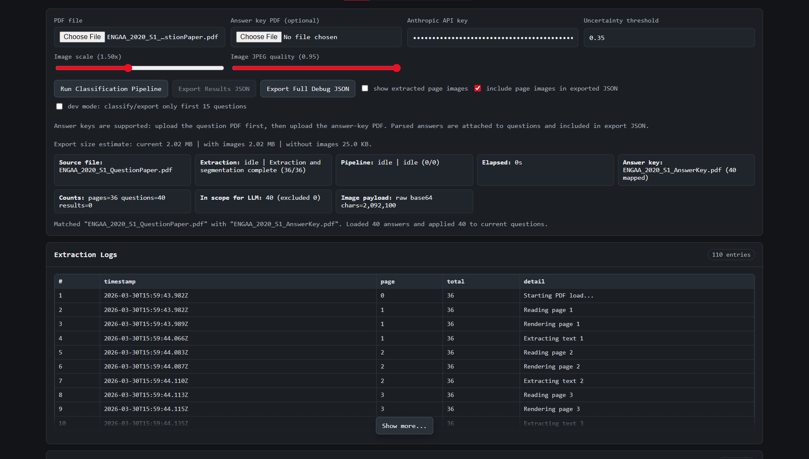
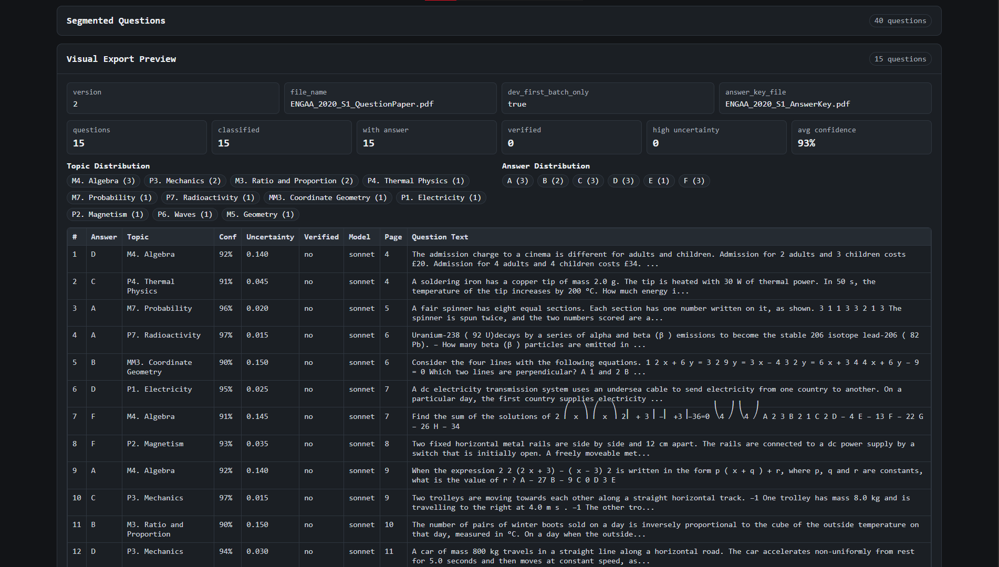
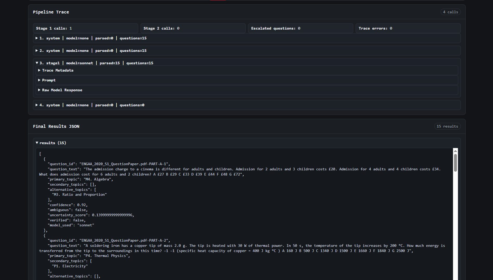

# ESAT Practice


Monorepo for an ESAT prep platform with two apps:

1. `esat-data-pipeline`  
   Data processing/classification tooling for question content.
2. `esat-practice-website`  
   Learner-facing ESAT practice app.

## Table of Contents

1. [Repository Layout](#repository-layout)
2. [Quick Start](#quick-start)
3. [Commands](#commands)
4. [Pipeline to Website Workflow](#pipeline-to-website-workflow)
5. [Screenshots](#screenshots)
6. [Contributing](#contributing)
7. [License](#license)

## Repository Layout

```text
esat-practice/
|- esat-data-pipeline/
`- esat-practice-website/
```

## Quick Start

Prerequisites:

- Node.js 20+
- npm 10+

Install dependencies:

```bash
cd esat-data-pipeline
npm install

cd ../esat-practice-website
npm install
```

Run both apps (in separate terminals):

```bash
# Terminal 1
cd esat-data-pipeline
npm run dev

# Terminal 2
cd esat-practice-website
npm run data:prepare
npm run dev
```

## Commands

### `esat-practice-website`

- `npm run dev` - local website dev server
- `npm run data:prepare` - generate `public/data/manifest.json` + data packs
- `npm run verify:loader` - validate loader and data shape
- `npm run build` - data prepare + type-check + production build

### `esat-data-pipeline`

- `npm run dev` - local pipeline dev server
- `npm run check:question-counts` - validate extraction counts
- `npm run build` - type-check + production build

## Pipeline to Website Workflow

1. Process/refine source data in `esat-data-pipeline`.
2. Update the website's source data inputs.
3. In `esat-practice-website`, run:
   - `npm run data:prepare`
   - `npm run verify:loader`
   - `npm run build`
4. Deploy website artifacts.

Notes:

- Generated website data artifacts are intentionally ignored in git:
  - `esat-practice-website/public/data/packs/`
  - `esat-practice-website/public/data/manifest.json`

## Screenshots

### Pipeline Dashboard





## Contributing

1. Branch from `main`.
2. Keep commits scoped and descriptive.
3. Before opening a PR, run build checks for changed projects:
   - `esat-practice-website: npm run build`
   - `esat-data-pipeline: npm run build`
4. For UI changes, include before/after screenshots in the PR.

## License

Licensed under MIT. See [LICENSE](./LICENSE).
